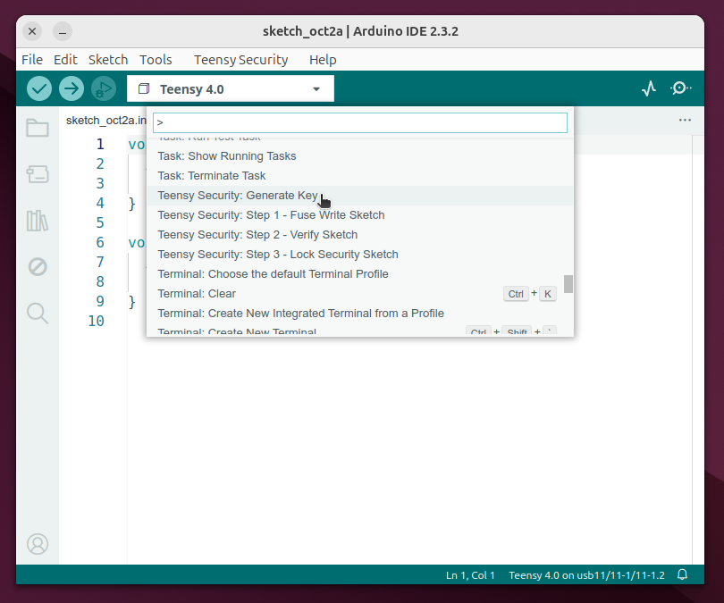
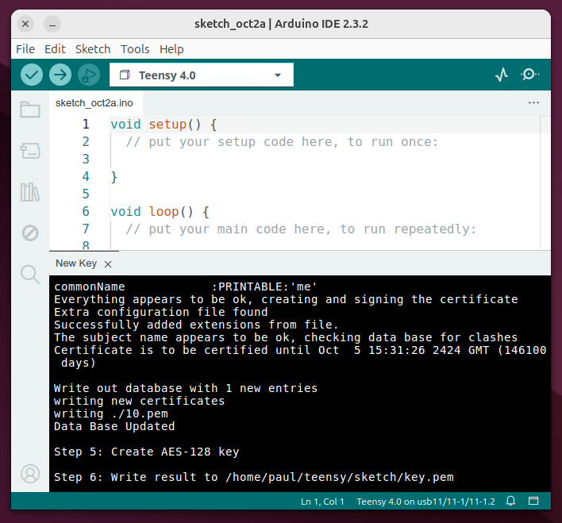
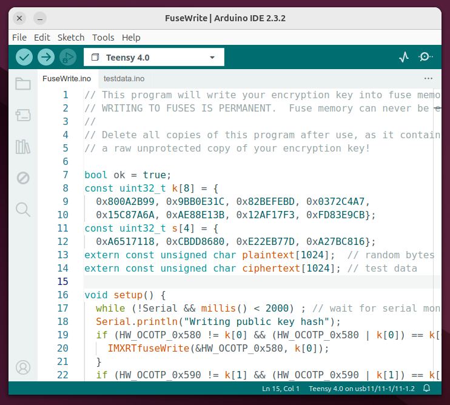

# Teensy Security Plugin for Arduino IDE 2.x

This plugin supports use of [code security on Teensy 4.x](https://www.pjrc.com/teensy/td_code_security.html) by adding commands to Arduino IDE.  They are accessed by pressing Ctrl-Shift-P (or Command-Shift-P on MacOS).

## Generate Key

The Generate Key creates a new private key.  This key is required before using the other commands.  If you already created a key, with this plugin or using the "Teensy 4 Security" plugin with Arduino 1.8.x, your prior key.pem file will be renamed.

**Back up your key.pem file!**  If you lose this file, you will no longer be able to compile programs which will run on all Teensy boards locked with your key.

## Show Key Location

This command simply shows a message with the full pathname of your key.pem file.  If you create more than 1 key, you will need to place the key you wish to use at this location.

If you used [Teensy 4 Security on Arduino 1.8.x](https://github.com/PaulStoffregen/secure_plugin), and if Arduino 1.8.x was configured for a different sketchbook location, the key.pem file from your old sketchbook location may be used.  This command shows the actual full pathname of the key.pem file actually used when encrypting your .hex files to .ehex.

## Step 1, 2, 3

These 3 commands create the 3 sketches needed to write your key to the Teensy permanent fuse memory, verify encryption works, and permanently lock Teensy into secure mode.

